# 2019CVFX_Homework1_Team5

## Training

### 1. apple2orange
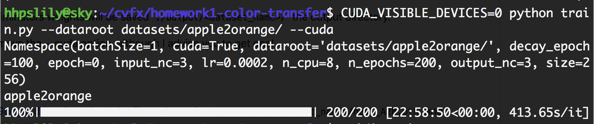

### 2. horse2zebra
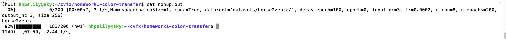

### 3. summer2winter
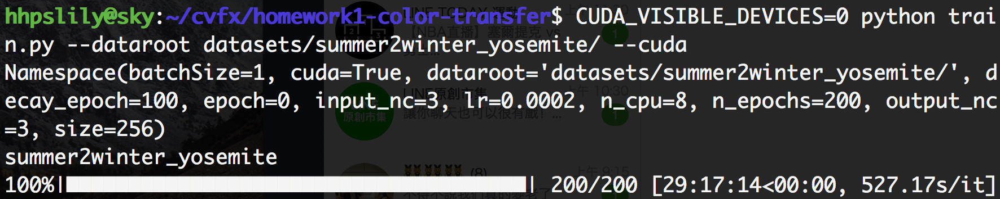

## Inference Personal Images(CYCLE GAN)
### Winter2Summer Dataset
由於 GAN 在訓練時不一定會越 train 越好，有可能是中間的結果是最佳的， 
所以我們在 train 的時候也不定時會 inference 觀察產生的結果
以下為 train 到 124 個 epoch 的結果  

#### 1. Summer to winter 
 

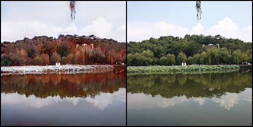

#### 2. Winter to summer
 
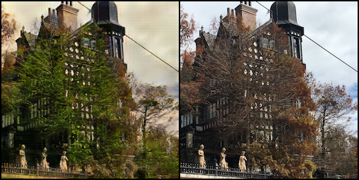
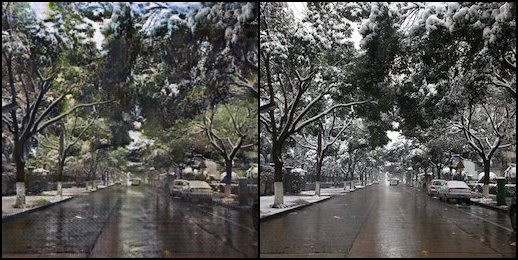
 
 
由上面的結果可以看出來效果還不錯，已經有一點秋冬的感覺
接下來為 train 完 200 個 epoch 的結果 
 
 

#### 1. Summer to winter 
 
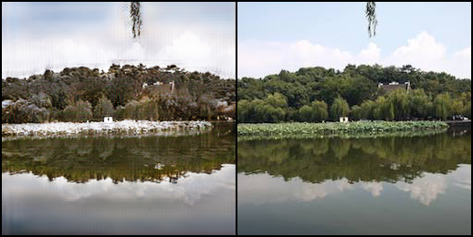
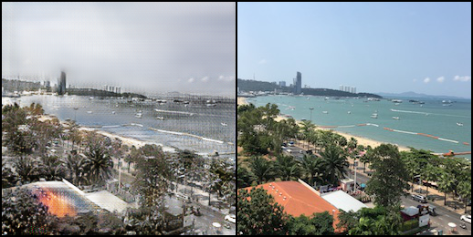
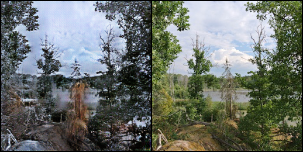
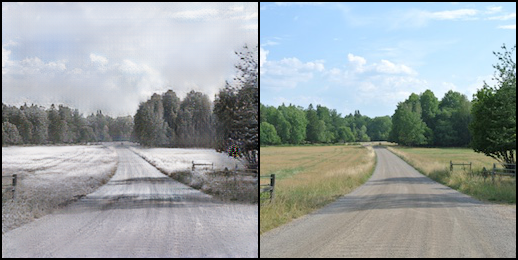

#### 2. Winter to summer
 
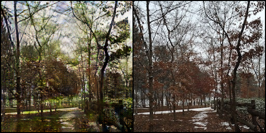
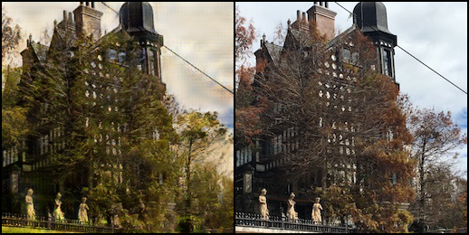
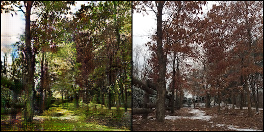
 
 

最後 train 完的結果我們認為更接近冬天一點，但感覺畫質有變差
