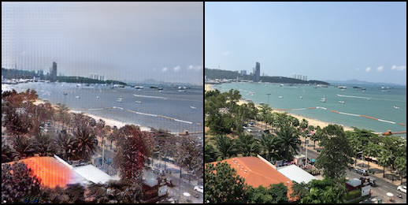

# 2019CVFX_Homework1_Team5

## Training

### 1. apple2orange

### 2. horse2zebra

### 3. summer2winter

### 4. monet2photo

## Inference Personal Images(CYCLE GAN)
### Winter2Summer 
由於 GAN 在訓練時不一定會越 train 越好，有可能是中間的結果是最佳的， 
所以我們在 train 的時候也不定時會 inference 觀察產生的結果
以下為 train 到 124 個 epoch 的結果  

 

 
由上面的結果可以看出來效果還不錯，夏天轉冬天的部分已經有秋冬的感覺。第二張圖片可以看到，原本湖邊綠地的部分被換成了很像積雪的感覺，而冬天轉夏天的圖片葉子也看得出變得翠綠。但是目前的缺點是照片看起來都偏紅色系。
 
接下來為 train 完 200 個 epoch 的結果 
 

 

 

 

 

最後 train 完的結果我們認為更接近冬天一點，畫面也不會像 124 個 epoch 的時候一樣會偏紅色，轉換出來的圖片更有冬天的滄桑感。而在冬天轉夏天的部分綠色的深淺效果好像也有更明顯。

### Apple2Orange
橘子與蘋果互換的部分效果不如夏天冬天轉換的效果好，我們認為這是因為蘋果跟橘子要轉換是需要比較局部的顏色以及材質轉移（橘子的皮會有一種特殊的紋路），而冬天夏天要達到效果的話，如果整體色調上有轉移成功就可以讓人有冬/夏天的感覺了。 

 

### Horse2Zebra
馬跟斑馬的互換，一開始我們認為蠻成功的  

 
直到我們試到下面這個有趣的失敗的例子 

 
我們認為會導致這樣的結果是因為人的皮膚也會偏黃色或咖啡色，導致再 training 的時候，可能還沒訓練到能夠分辨出人與馬的差異，所以在轉換的時候會把人也裹上斑馬紋。

### Monet2Photo
Monet to photo 的部分，在照片轉莫內畫風的部分比較成功，CYCLE GAN 能夠很好的學到了畫的筆觸以及色系的部分。但是想要讓他學到什麼是「真實」的就會比較困難，因為「真實」的紋理以及色彩比較難以界定，也比較多元，而且照片有點模糊不清，真實感也會下降，所以想要學習到好的轉換的話可能要再多調一些其他的參數多加嘗試。 

 

## Compare With Other Method
其他方法方面，我們嘗試了助教提供的super fast color transfer，以下是轉換後的結果。 

 
相較於需要超過 24 小時 training 的 cycleGAN，super fast color transfer 只要透過對 source 跟 target 兩張圖片的 L*a*b channels 的 mean 與 standard deviation 計算做轉換，在運算上快速許多。然而，由上面的成果圖片可以觀察到，super fast color transfer 的效果比較像直接將 target 圖片套上有 source 圖片顏色的濾鏡，並且可能會轉出奇怪的圖片（如上最後一張圖）。很明顯地，cycleGAN 在細節的處理上較為精緻（例如，夏天的藍天空會轉換成灰冷的顏色，綠葉變得比較暗沈或楓紅)。此外，cycleGAN只需要一張圖片即可轉換，super fast color transfer則需要一張source圖片（轉換色調）以及target圖片（要被轉換色調的圖）才能完成。同時，使用super fast color transfer的方法，如果兩張照片大小不同也能順利轉換。
 
我們也嘗試了另一種 [color transfer](https://github.com/mottc/ColorTransfer) 的方法，這部分則是透過將兩張原圖轉換成 HSV Color Space，再根據每個像素轉成的H值做接下來的計算，以下為我們的結果圖。 

 
Origin為我們要轉換的圖片，reference則為目標顏色，在運算上，這和我們上一個嘗試的super fast color transfer速度差不多。在成果上，這種color transfer方法針對一個特定物體的顏色轉換效果算是相當精緻，我們可以看到測試圖片中的紅玫瑰都有成功被轉換成鬱金香的紫色，旁邊的葉子保有原本的綠色。
然而這個方法如果同樣運用在夏天冬天的轉換上，效果就沒有那麼好了，這可能是因為這個方法不太適合用在大範圍的色調改變上，而是比較適合轉換特定物品的顏色。 

 
我們也有把它運用到蘋果轉換成橘子上，最左邊的圖為此方法產生的結果，第二張為 CYCLE GAN 轉換的效果，第三張為原圖，最後一張為 source。可以看到，此方法有順利將橘色轉換蘋果上，但由於缺乏材質的轉換，效果不如 CYCLE GAN。

## 結論
三種方法中我們覺得 CYCLE GAN 是最好的方法，但是他需要花上很多的時間、資源去訓練。並且由於是 generator 所產生的圖片，所以圖片難免會有一些模糊與失焦。其他兩種方法因為都只有顏色轉移的部分，沒有牽涉的材質的轉移，所以在效果上不會那麼好，但是圖片比較能夠保有原本的清晰度。
